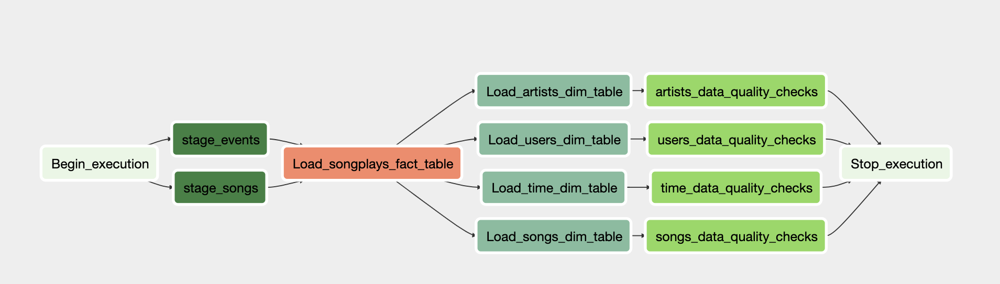

# Overview:

Sparkify is a music streaming app used by users to listen songs. It collects user activity and songs data in AWS S3 through their app. Now they want to use this data to create a data warehouse in AWS RedShift which will help them to analyse their data and find insight which can bring positive growth into the business.

# Source Files: 

There are two source files we have on AWS S3 as shown below:

1) Song Files - It holds information about songs' metadata along with artists' details
2) Log Files - It holds details about users' activity on apps 

# Requirements & Specifications:

For Sparkify, use Song and Log source files and load them into star schema datawarehouse in AWS RedShift through staging using AirFlow DAG.

## Source Files (AWS S3):

1. s3://udacity-dend/log_data/

2. s3://udacity-dend/song_data/

## Staging Tables (AWS RedShift):

1. staging_events

2. staging_songs

## Target Tables (AWS RedShift):

### Dimension Tables:

1. artists

2. songs

3. time

4. users

### Fact Tables:

1. songplays

## Airflow DAG (/airflow/dags/udac_example_dag) with:

### Custom Operators:

1. DataQualityOperator (/airflow/plugins/operators/data_quality.py)  - To apply DQ checks data processing

2. LoadDimensionOperator (/airflow/plugins/operators/load_dimension.py) - To load dimension tables

3. LoadFactOperator (/airflow/plugins/operators/load_fact.py) - To load fact tables

4.  StageToRedshiftOperator (/airflow/plugins/operators/stage_redshift.py) - To load json files from S3 into Staging tables

### Helpers - SQL Queries:

1.  /airflow/create_tables.py

2. /airflow/plugins/helpers/sql_queries.py

### DAG Configurations:

1. Not have dependency on previous runs

2. On Failure, the task are retried 3 times

3. Retry happens every 5 min

4. Catchup is turned off

5. Does not email on retry

### DAG GraphView:
